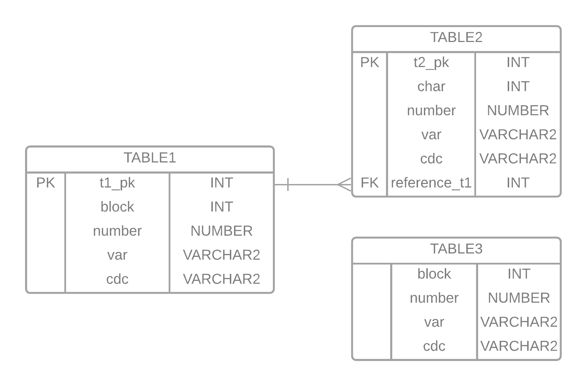

# DGEN

El proyecto **dgen** esta pensado como generador de Datos (transacciones) para pruebas de migración de Bases de Datos Oracle. El principal proposito de **dgen** es la definición de un esquema simple de datos al interior de una  (```base de datos Oracle existente```), sobre la cual se definen 3 tablas para ```crear```, ```actualizar``` y ```eliminar``` registros en cada una de ellas de manera controlada; esto permite validar las acciones de replicación que el usuario ha implementado usando servicios o herramientas espacíficas para tal proposito, las cuales toman como origen de los datos la misma (```base de datos Oracle existente```).

Si bien las herramientas de migración cuentan con esquemas de validación de datos (Ejemplo: AWS DMS), **dgen** permite poblar y modificar rgistros de manera controlada, de tal forma que sea posible validar acciones precisas sobre los datos, lo que facilita el desarrollo de pruebas enfocadas en la viabilidad del uso de herramientas de migración y la consistencia de la información.

## Instalación

**dgen** se emplea a través de la linea de comandos de linux, de tal forma que es importante contar con las dependencias que este software requiere y que la maquina linux a emplear tenga alcance a la ```base de datos Oracle existente```. A continuación se enlistan los elementos prinicipales y posteriormente se evidencia como desarrollar la instalación y preparación del ambiente.

**Dependencias:**

* oracle-instantclient
* python3
* cx_Oracle (python-lib)
* pandas (python-lib)

**Dependencias en AWS EC2:**

Para este ejemplo, se hace uso de una instancia EC2 de AWS icon la imagen 'AWS Linux 2 AMI'.

Para configurar la instacias porfavor descargue ```oracle-instantclient12.2-basic-12.2.0.1.0-1.x86_64.rpm``` de [este sitio](https://www.oracle.com/database/technologies/instant-client/linux-x86-64-downloads.html). Una vez ha descargado el archivo proceda con la instalación:

```bash
sudo yum update -y
sudo yum install oracle-instantclient12.2-basic-12.2.0.1.0-1.x86_64.rpm
sudo yum install git -y
sudo sh -c "echo /usr/lib/oracle/12.2/client64/lib > /etc/ld.so.conf.d/oracle-instantclient.conf"
sudo ldconfig
export LD_LIBRARY_PATH=/usr/lib/oracle/12.2/client64/lib:$LD_LIBRARY_PATH
python3 -m pip install cx_Oracle pandas --upgrade --user
```

**Instalación dgen:**

Para este paso es necesario descargar este proyecto desde githup, para ello basta con ejecutar el siguiente comando:

```bash
cd $HOME
git clone <this-repo>
echo 'export $PATH:"<path-to-the-bin-folder-of-dgen>"' >> .bashrc
source .bashrc
```

## Uso de dgen

Una vez se ha completado la instalación, se puede hacer uso de **dgen**. En caso de que ara un inicio rápido ejecutar:

```bash
dgen config -l = <oracledb-source.XXXXXXXXX.region.rds.amazonaws.com> \
    -s = <SID> \
    -u = <username> \
    -x = <userpassword> 
```

Luego pidemos ejecutar la inicalización de los esuqemas implementados por **dgen** usando:

```bash
dgen init
```

Esta accion creará 3 tablas con el siguiente esquema:



Ahora podemos imprimir información relacionada a cada tabla usando:

```bash
dgen data
```

Y tambien podemos poblar tablas usando el siguiente comando (en este caso unicamente para la tabla 1):

```bash
dgen insert -t table1 -n 10 -b 1,2,3 
```

En el ejemplo anterior el argumento ```-t``` es usado para definir la tabla, ```-n``` es usado para definir el número de filas a crear y ```-b``` es usado par adefinir los blocks que necesitamos. Finalmente podemos imprimir nuevamente la información de cada tabla usando ```dgen data```.

**Importante:**

El proyecto **dgen** usa la variable llamada **block** en cada tabla para crear tags sobre los registros mientras se hace uso de  ```dgen insert``` empleando el argumento ```-b```.

Dichos tags pueden ser tabmien usados para identificar y ejecutar actualizaciones y eliminaciones sobre los registros que contengan los bloques específicos. Podemos usar ```dgen delete -t table1 -b 1,2``` para borrar registros que contengan blocks con valores de ```1``` o ```2```, y también podemos usar ```dgen update -t table1 -b 1 -m 'update-message'``` para actualizar los registros de los blocks iguales a ```1``` y cambiar el valor de la variable ```cdc``` usando el argumento ```-m```.

## Comandos dgen

TODO...
